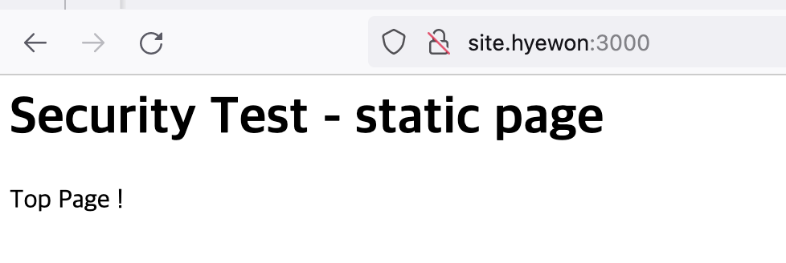

# Node.js + Express를 사용한 HTTP 서버 구축하기


### 1. Node.js, npm 설치
``` bash
 ~ % brew install node    

 ~ % node -v
v22.0.0
  ~ % npm -v
10.5.1
```

### 2. package.json 생성 & Express 설치
``` bash
npm init -y
npm install express -save
```

### 3. 서버 구축
``` bash
node server.js
npm start
```

### 4. 정적 리소스 전달

### 5. 호스트명 변경하기 
``` bash
127.0.0.1       site.hyewon
```
